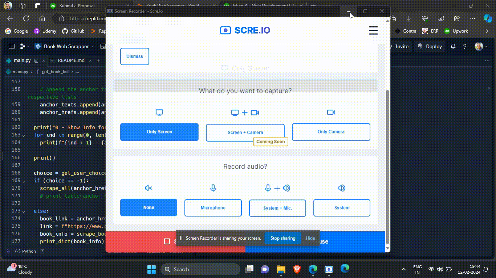

# Book Insights - A Web Scrapping Project
A simple program that takes name of a book from the user, searches the Good Reads website for results, and shows details of all the books in the list returned by Good Reads, or, shows information of one specific book that user wants. 
The entire program gets its information from Good Reads using web scrapping technique implemented using the BeautifulSoup library.

## Code Ouput

## View the Project on [Replit](https://replit.com/@ishandeveloperg/Book-Web-Scrapper)

## Things to Note:
- This project has been developed to simply have a project in the area of web scrapping. I can definitely do more with this project, e.g., integrate it with a frontend web application to provide this program through the internet.
- I can also develop programs much complex than this, but I do not have any exciting idea right now, so if you have any great and exciting ideas, do let me know and lets built them together.
- The code logic has been implemented by me. I delegated the redundant task to ChatGPT, as it was within my capability but, due to a temporary state of lethargy, I chose not to undertake it myself. 🥱😴🥱😴

Feel free to play with the code and use it however you like, just remember to acknowledge my work.